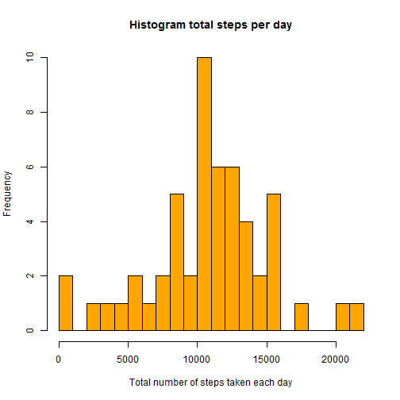
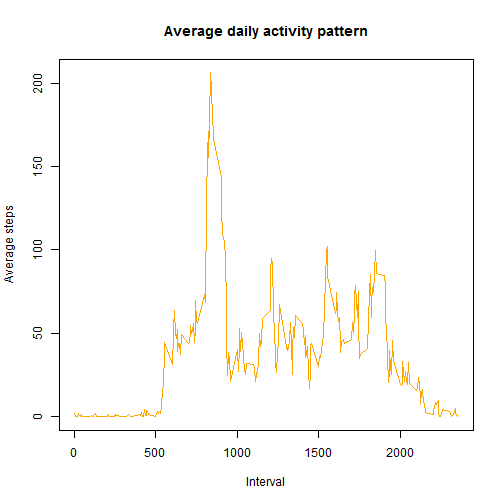
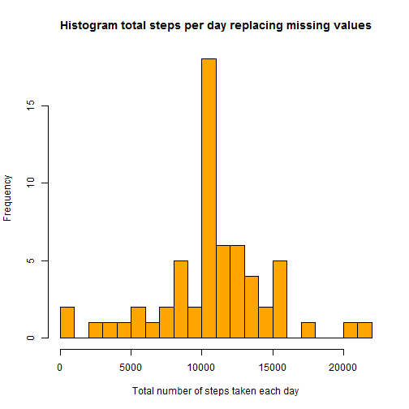
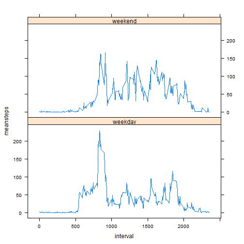

```r
#  Load libraries
library(lattice)
library(dplyr)
```

```
## 
## Attaching package: 'dplyr'
## 
## The following object is masked from 'package:stats':
## 
##     filter
## 
## The following objects are masked from 'package:base':
## 
##     intersect, setdiff, setequal, union
```

## Loading and preprocessing the data

```r
stepsData <- read.csv("activity/activity.csv")
stepsData$date <- as.Date(stepsData$date, format = "%Y-%m-%d")
stepsDataNoNA <- filter(stepsData, !is.na(stepsData[,1]))
```
## What is mean total number of steps taken per day?

```r
stepsByDay <- stepsDataNoNA %>% group_by(date) %>% summarise(sum(steps))
names(stepsByDay)[2] <- "dailySteps"
hist(stepsByDay$dailySteps, breaks = 20, main = "Histogram total steps per day", xlab = "Total number of steps taken each day", col = "orange")
```

 

```r
# Mean number of steps per day
mean(stepsByDay$dailySteps)
```

```
## [1] 10766.19
```

```r
# Median number of steps per day
median(stepsByDay$dailySteps)
```

```
## [1] 10765
```
## What is the average daily activity pattern?

```r
stepsByInterval <- stepsDataNoNA %>% group_by(interval) %>% summarise(mean(steps))
names(stepsByInterval)[2] <- "MeanSteps"
plot(stepsByInterval$interval, stepsByInterval$MeanSteps, type = "l", xlab = "Interval", ylab = "Average steps", main = "Average daily activity pattern", col = "orange")
```

 

```r
# Which 5-minute interval, on average across all the days in the dataset, contains the maximum number of steps?
stepsByInterval[max(stepsByInterval$MeanSteps), 1]
```

```
## Source: local data frame [1 x 1]
## 
##   interval
## 1     1705
```


## Imputing missing values

```r
# Total number of missing values
sum(is.na(stepsData[,1]))
```

```
## [1] 2304
```

```r
# Replacing missing values with the average steps for that interval
stepsReplacedData <- stepsData
for (i in 1:nrow(stepsReplacedData)) {
      row <- stepsReplacedData[i,]
      if (is.na(row[1,1])) {
            stepsReplacedData[i, 1] <- (stepsByInterval[stepsByInterval$interval == row[1, 3],2])            
      }
}
stepsByDayReplacedData <- stepsReplacedData %>% group_by(date) %>% summarise(sum(steps))
names(stepsByDayReplacedData)[2] <- "dailySteps"
hist(stepsByDayReplacedData$dailySteps, breaks = 20, main = "Histogram total steps per day replacing missing values", xlab = "Total number of steps taken each day", col = "orange")
```

 

```r
# Mean total number of steps per day
mean(stepsByDayReplacedData$dailySteps)
```

```
## [1] 10766.19
```

```r
# Median number of steps per day
median(stepsByDayReplacedData$dailySteps)
```

```
## [1] 10766.19
```
The mean has not changed and media is very close to the value calculated without replacing missing values. This is due to the fact that we have used the mean of each interval to replace them.

## Are there differences in activity patterns between weekdays and weekends?

```r
# Create a new factor variable with two levels – “weekday” and “weekend”
wDay <- c("Mon", "Tue", "Wed", "Thu", "Fri")
wEnd <- c("Sat", "Sun")
stepsReplacedData$day <- (weekdays(stepsReplacedData$date,  abbreviate = TRUE))
stepsReplacedData$weekday <- ifelse(stepsReplacedData$day %in% wDay, "weekday", "weekend")

weekendData <- filter(stepsReplacedData, weekday == "weekend") %>% group_by(interval) %>% summarise(meansteps = mean(steps)) %>% mutate(weekday = "weekend")
#need to ask column
weekdayData <- filter(stepsReplacedData, weekday == "weekday") %>% group_by(interval) %>% summarise(meansteps = mean(steps)) %>% mutate(weekday = "weekday")
weekendWeekdayData <- rbind(weekendData, weekdayData)

xyplot(meansteps ~ interval | weekday, data = weekendWeekdayData, layout=c(1,2), type="l")
```

 
